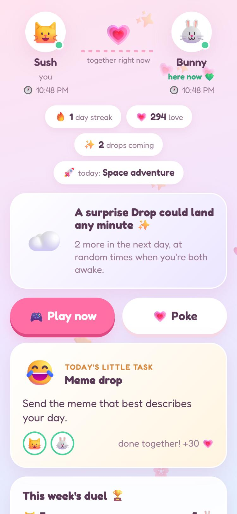
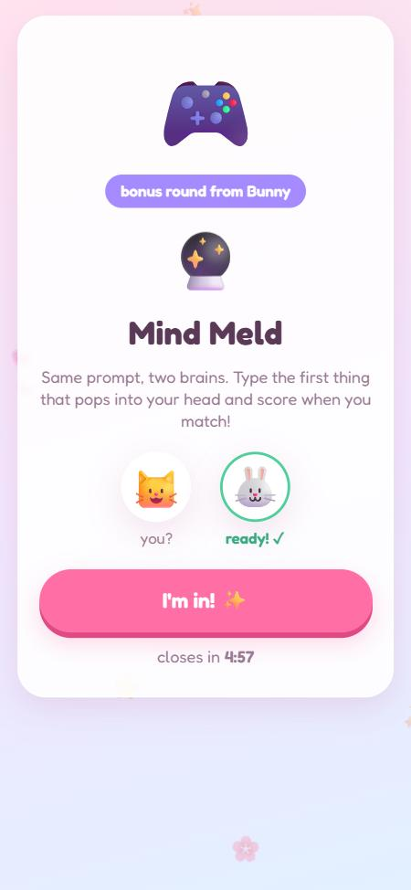
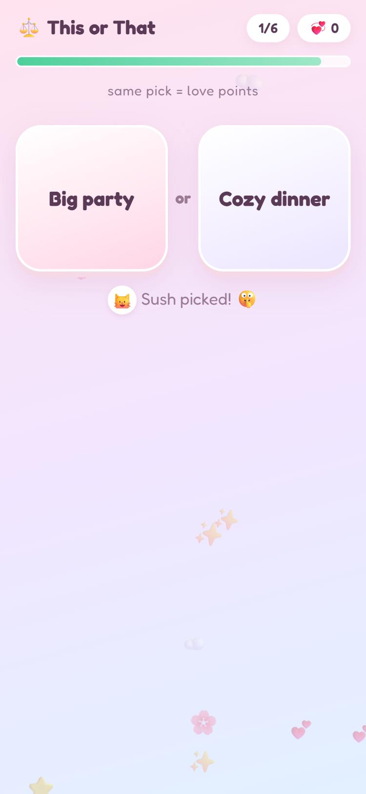
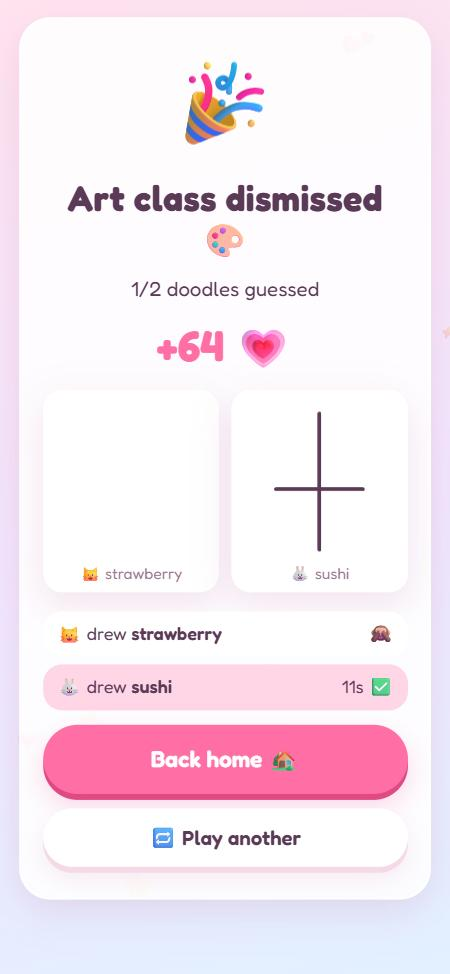
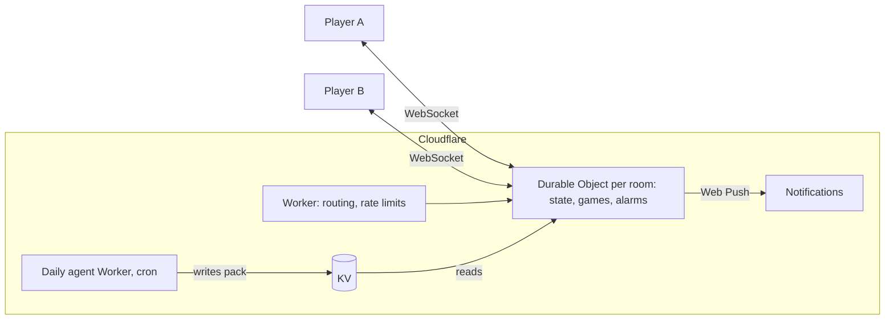

<div align="center">


# Duo Drops

Live mini games for two people in different places. Short challenges drop onto both phones at random times through the day.

[Live app](https://duo-drops.duo-drops.workers.dev) · [How it works](#how-it-works) · [Daily agent](#daily-agent) · [Self-hosting](#self-hosting)

</div>

## Why

A personal project. My girlfriend and I are long distance, and most of our time together is small gaps in the day rather than long calls. I wanted something that fits those gaps: a few times a day, at a random moment when we're both awake, both phones get a notification, we play a one or two minute game together, and get back to our days.

It works for any two people, so it's open for anyone to use.

<div align="center">




</div>

## Features

**Games** (all run server-side, answers are never sent to clients before the reveal)

| Game | Description |
|---|---|
| Mind Meld | Both players get the same prompt and type an answer. Matching answers score. Matching tolerates plurals and small typos. |
| Speed Duel | Five short races: unscramble, arithmetic, counting, odd one out, reaction time. Wins count toward a weekly score. |
| Doodle Guess | One player draws, strokes stream live to the other, who guesses. Letter hints over time. Roles swap. |
| Today's Special | A This or That game generated fresh each day by the daily agent. |

**Around the games**
- Surprise Drops: 1 to 10 per day, scheduled only in hours when both players are awake in their own time zones.
- Play now at any time; the other player gets a notification and five minutes to join.
- A small daily real-life task, pokes, streaks, and a weekly duel with a prize the two of you choose.
- Shows the other person's local time and online status.
- Installable PWA with push notifications on Android, desktop, and iOS (from the Home Screen).

## How it works



- Each room is its own Durable Object (SQLite-backed, hibernating WebSockets). Rooms share no state.
- Drop times are planned per room and fired with Durable Object alarms.
- Web Push is implemented directly on WebCrypto (RFC 8291 payload encryption, RFC 8292 VAPID) with no dependencies.
- The frontend is plain ES modules with no build step.
- Runs on Cloudflare's free plan.

## Daily agent

A separate Worker in [`agent/`](agent/) runs twice a day and makes sure the packs for today and tomorrow (UTC) exist:

1. Loads the previous week's themes to avoid repeats.
2. Asks Workers AI (Llama 3.3 70B, falling back to 8B) for a theme, a daily task, six This or That pairs, and themed prompts and drawing words.
3. Validates the output with [`sanitizeDaily`](src/daily.js): length limits, no links, a word blocklist, letters-only drawing words, emoji checks.
4. If both models fail, uses a deterministic fallback pack seeded by the date.
5. Writes the pack to KV with a 5 day TTL. Rooms read it for their local date.

`GET` on the agent's URL returns the current pack. Generation only happens on the cron schedule.

## Privacy and security

- No accounts or emails. A room stores names, avatars, time zones, scores, and recent game history.
- Invite links carry a one-time key in the URL fragment, which is not sent to the server. The room closes to new players once the second person joins.
- Device tokens are sent in the `Authorization` header or the WebSocket subprotocol, never in URLs.
- Players see each other's name, avatar, local time, and online status only.
- Either player can delete the room, which erases all of its data. Inactive rooms stop scheduling after 7 days and delete themselves after 120 days.
- Per-IP rate limits on room creation and joining, message size limits, input validation, CSP and related security headers.

## Self-hosting

Requires a Cloudflare account (free) and Node 20+.

```bash
git clone https://github.com/sushantlokhande14/duo-drops && cd duo-drops
npm install
npm run keys                                  # VAPID keys, written to gitignored files
npx wrangler login
npx wrangler kv namespace create DAILY        # put the id in wrangler.jsonc and agent/wrangler.jsonc
npx wrangler deploy
npx wrangler secret bulk .vapid-secrets.json
npx wrangler deploy -c agent/wrangler.jsonc
```

Set `VAPID_SUBJECT` in `wrangler.jsonc` to your own `mailto:` address or URL.

The free plan should handle dozens to a few hundred active rooms per day. Beyond that, Cloudflare's paid Workers plan ($5/month) raises the limits.

## Development

```bash
npm run dev    # http://127.0.0.1:8787
npm test       # game logic, daily pack validation, agent fallbacks, push encryption
```

To play both sides locally, open `http://localhost:8787` and `http://127.0.0.1:8787`; they are separate origins with separate storage.

| Area | File |
|---|---|
| Routing, rate limits | [`src/worker.js`](src/worker.js) |
| Rooms, scheduling, sockets | [`src/room.js`](src/room.js) |
| Game rules | [`src/games.js`](src/games.js) |
| Daily pack and validation | [`src/daily.js`](src/daily.js) |
| Daily agent | [`agent/src/index.js`](agent/src/index.js) |
| Web Push | [`src/push.js`](src/push.js) |
| Frontend | [`public/`](public/) |

Prompts, words, and emoji sets live in [`src/content.js`](src/content.js).

## License

MIT
