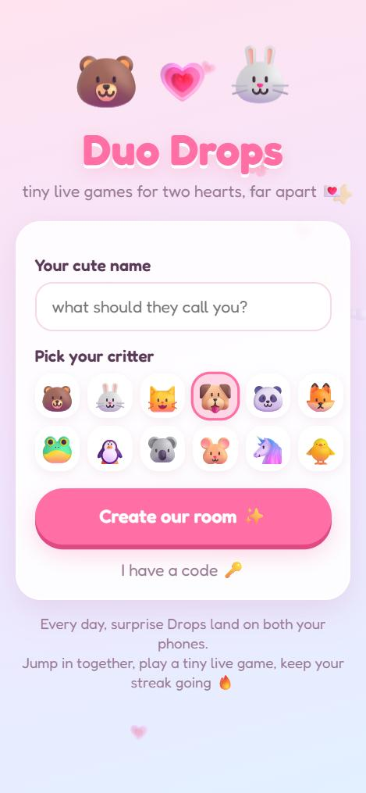
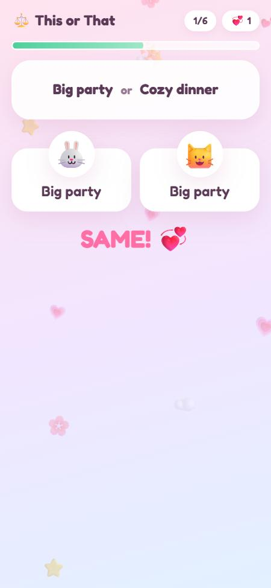
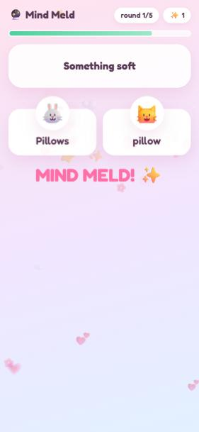
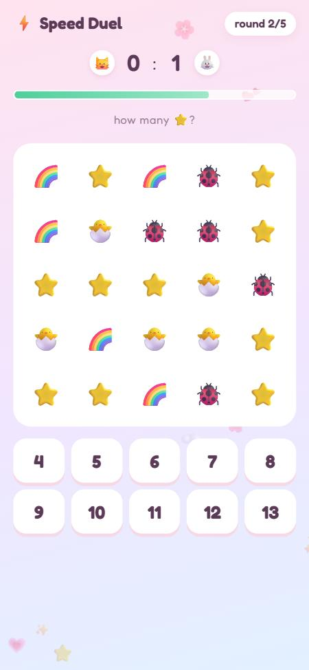
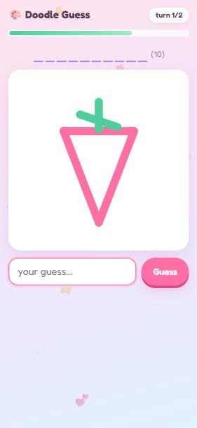
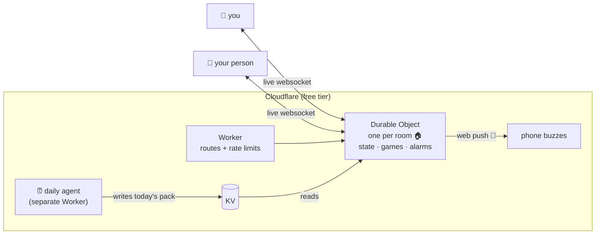

<div align="center">

# 💌 Duo Drops

**tiny live games for two hearts, far apart**


surprise mini games *drop* onto both your phones through the day 🎁 jump in together, play for two minutes, keep your streak alive 🔥

[**▶ play it now**](https://duo-drops.duo-drops.workers.dev) · [how it works](#-how-it-works) · [the daily agent](#-the-daily-agent) · [host your own](#-host-your-own-free)


</div>

---

## 🧸 why this exists

This is a personal project. My girlfriend and I are long distance 💞

Long distance is mostly little gaps. A few minutes on a break, on the bus, before bed. Texting "how was your day" on repeat gets old, and video calls need both of you free at the same time.

So I built us something that comes *to* us. A few times a day, at a random moment when we're both awake (in our own time zones), both phones buzz: **💌 a Drop just landed!** We both jump in, play a tiny live game for a minute or two, laugh, and go back to our days. There's a streak to protect, a weekly duel with a real prize (winner picks the next movie night 🍿), and a little real-life task every day.

It's cute on purpose. It's free on purpose. And now anyone can use it, so if you have a favorite person far away, it's yours too 💗

<div align="center">




</div>

## 🎮 the games

| | game | how it plays |
|---|---|---|
| 🔮 | **Mind Meld** | Same prompt on both screens ("something soft"). Type the first thing you think of. Match = love points. Forgiving about plurals and typos, so *pillows* = *pillow* ✨ |
| ⚡ | **Speed Duel** | Five tiny races: unscramble a word, quick maths, count the 🍓, spot the odd emoji, tap when the 💗 appears. First right answer takes the round. Wins count toward the weekly duel 🏆 |
| 🎨 | **Doodle Guess** | One of you draws live, the other guesses as the strokes appear. Letters get revealed as hints. Then swap. Your masterpieces get saved on the results screen 🖼️ |
| ✨ | **Today's Special** | A brand new *This or That* game, written fresh every day by the [daily agent](#-the-daily-agent). Pick the same side, win love 💞 |

<div align="center">





</div>

## 💗 the little things

- **Surprise Drops**: 1 to 10 a day (you choose), only during hours you're *both* awake, across time zones. Miss one? Another is on the way.
- **Play now** anytime. If they're away, their phone buzzes and they get 5 minutes to hop in.
- **Pokes 💗**: a tap that floats hearts across their screen and buzzes their phone with something sweet.
- **Today's little task**: one small real-life thing to do for each other ("send a photo of your sky right now"). Both tap done → +30 love.
- **Streaks 🔥**, **love points 💗**, and a **weekly duel** with a prize you two pick.
- **Their local time** and whether they're online, right next to their critter, so you know if they're probably asleep 💤
- Installs to your home screen like a real app. Buzzes work on Android, desktop, and iPhone (once it's on your Home Screen).

## 🍰 how it works



- Every pair gets its **own Durable Object**: a tiny server that holds only their room. Rooms can't see each other at all.
- The Durable Object **schedules Drops with alarms**, runs every game **server-side** (your phone never receives answers before the reveal), and relays doodle strokes live.
- **Buzzes** use standard Web Push, implemented from scratch on WebCrypto ([RFC 8291](https://www.rfc-editor.org/rfc/rfc8291) + [VAPID](https://www.rfc-editor.org/rfc/rfc8292)), no libraries, no Firebase.
- The frontend is plain JavaScript modules, no build step. Fredoka font, pastel everything, bouncy critters 🐻🐰

## 🤖 the daily agent

A separate Worker ([`agent/`](agent/)) wakes up twice a day and makes sure today's and tomorrow's **daily pack** exist:

1. reads the last week of themes so it doesn't repeat itself
2. asks **Workers AI** (Llama 3.3 70B, free daily allowance) to invent a theme, a little real-life task, a themed *This or That* game, and themed prompts and doodle words for the other games
3. runs everything through a strict safety gate ([`sanitizeDaily`](src/daily.js)): length caps, no links, no unsafe words, letters-only doodle words, valid emoji
4. if the big model fails, tries a smaller one, and if that fails too, falls back to a hand-written pack seeded by the date. The app **never** breaks because of the AI
5. stores the pack in KV, where every room picks it up

A real one it made:

> 🍁 **Fall Fun** · task: 📸 *Leaf Photo*, "take a photo of a leaf or something autumnal outside your window and send it to your partner" · special: 🎃 *Harvest Choices*: Apple or Pumpkin? Hayride or Hike? Scarecrow or Ghost?

Peek at today's pack: `https://<your-agent>.workers.dev/` (read-only; generation only ever happens on the schedule).

## 🔒 privacy + safety

- **No accounts, no emails, no tracking.** A room stores names, critters, time zones, scores and game history. That's it.
- **Private invites**: the invite link carries a one-time key in the URL `#fragment` (never sent to any server). Once your person joins, the room locks to just you two.
- **Device keys stay out of URLs**: they travel in headers (`Authorization` / WebSocket subprotocol), so they don't end up in logs or browser history.
- Your person sees your **name, critter, local time and online status**. Never your device key or notification details. Game answers stay hidden until both of you have answered.
- **Delete our room** wipes everything instantly for both of you. Rooms nobody opens for 7 days stop scheduling Drops, and after 4 months they delete themselves.
- Per-IP rate limits on creating/joining rooms, size limits on every message, a strict Content-Security-Policy, and everything user-written is escaped.

## 🏡 host your own (free)

You need a free [Cloudflare](https://dash.cloudflare.com/sign-up) account and Node 20+.

```bash
git clone https://github.com/sushantlokhande14/duo-drops && cd duo-drops
npm install
npm run keys                                  # push notification keys (kept out of git)
npx wrangler login
npx wrangler kv namespace create DAILY        # paste the id into wrangler.jsonc and agent/wrangler.jsonc
npx wrangler deploy                           # the app
npx wrangler secret bulk .vapid-secrets.json
npx wrangler deploy -c agent/wrangler.jsonc   # the daily agent
```

Change `VAPID_SUBJECT` in `wrangler.jsonc` to your own `mailto:` or website.

**How far does free go?** Rooms are tiny and Durable Objects hibernate between messages, so the free plan comfortably covers dozens to a few hundred active pairs a day. Past that, Cloudflare's $5/month plan lifts the limits.

## 🛠️ develop

```bash
npm run dev      # http://127.0.0.1:8787
npm test         # game rules, daily pack gate, agent fallbacks, push crypto
```

Play both sides on one computer by opening `http://localhost:8787` and `http://127.0.0.1:8787`. They're different origins, so each gets its own player.

| piece | where |
|---|---|
| routing, rate limits | [`src/worker.js`](src/worker.js) |
| rooms, Drop scheduler, sockets | [`src/room.js`](src/room.js) |
| game rules | [`src/games.js`](src/games.js) |
| daily pack + safety gate | [`src/daily.js`](src/daily.js) |
| daily agent | [`agent/src/index.js`](agent/src/index.js) |
| web push | [`src/push.js`](src/push.js) |
| the cute part | [`public/`](public/) |

Want more prompts or doodle words? Add them to [`src/content.js`](src/content.js) 💌

---

<div align="center">

made with 💗 for one long-distance couple, open to all

*if this made your long distance a little shorter, give it a ⭐*

</div>
